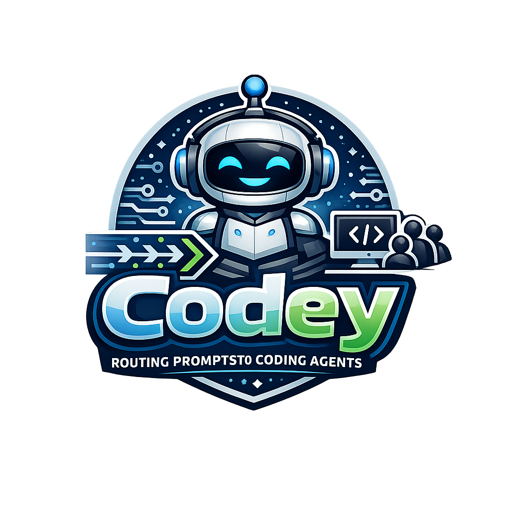

<p align="center">
  
</p>

# Codey 🚀

[English](README.md) | [中文](README.zh-CN.md)

A local gateway that routes prompts from chat platforms (Telegram, Discord, iMessage) to coding agents with support for multi-workspace and worker teams.

## Features

- **Multi-channel support**: Telegram, Discord, iMessage
- **Multiple coding agents**: Claude Code, OpenCode, Codex
- **Multi-workspace**: Each workspace has its own workers
- **Worker teams**: Define workers with roles, personalities, and relationships
- **Parallel execution**: Run multiple agents or workers simultaneously
- **Conversation context**: Remembers previous messages within a session
- **Health endpoints**: Built-in health check and metrics

## Quick Start

```bash
# Install dependencies
npm install

# Copy config template
cp gateway.json.example gateway.json

# Configure (optional)
npm run configure

# Start the gateway
npm start
```

## Configuration

Edit `gateway.json`:

```json
{
  "gateway": {
    "port": 3000,
    "defaultAgent": "claude-code",
    "defaultModel": "claude-sonnet-4-20250514"
  },
  "channels": {
    "telegram": { "enabled": true, "botToken": "YOUR_TOKEN" },
    "discord": { "enabled": false, "botToken": "" },
    "imessage": { "enabled": false }
  },
  "agents": {
    "claude-code": { "enabled": true, "provider": "anthropic", "defaultModel": "claude-sonnet-4-20250514" },
    "opencode": { "enabled": true, "provider": "openai", "defaultModel": "gpt-4.1" },
    "codex": { "enabled": true, "provider": "openai", "defaultModel": "gpt-5-codex" }
  },
  "profiles": [
    {
      "name": "default",
      "anthropic": { "apiKey": "sk-..." },
      "openai": { "apiKey": "sk-..." }
    }
  ],
  "activeProfile": "default",
  "dev": {
    "logLevel": "info"
  }
}
```

## Workspace Structure

```
workspaces/
├── default/
│   ├── workspace.json       # Workspace config (workingDir + workers)
│   ├── memory.md            # Project memory/notes
│   └── workers/
│       ├── architect.md
│       └── executor.md
├── project-a/
│   ├── workspace.json
│   ├── memory.md
│   └── workers/
│       └── ...
└── project-b/
    ├── workspace.json
    ├── memory.md
    └── workers/
        └── ...
```

Each workspace ties to a project directory via `workspace.json`:

```json
{
  "workingDir": "/path/to/project",
  "workers": {
    "architect": {
      "codingAgent": "claude-code",
      "model": "claude-opus-4-6",
      "tools": ["file-system", "git", "web-search"]
    }
  }
}
```

Switching workspaces (`/workspace myproject`) automatically sets the agent's working directory.

## Worker Configuration

Each worker is defined in a markdown file:

```markdown
# Worker: Architect

## Role
Lead architect responsible for project planning...

## Soul
Strategic thinker, focused on scalability...

## Coding Agent
claude-code

## Model
claude-opus-4-20250514

## Tools
file-system, git, web-search

## Relationship
Leads the implementation workers

## Instructions
When prompted, analyze requirements and provide...
```

## Commands

### Workers
| Command | Description |
|---------|-------------|
| `/workers` | List all workers in current workspace |
| `/worker <name> <task>` | Run a specific worker |
| `/team <task>` | Run workers in sequence |

### Workspaces
| Command | Description |
|---------|-------------|
| `/workspaces` | List all workspaces |
| `/workspace <name>` | Switch to a workspace |

### Agents (legacy)
| Command | Description |
|---------|-------------|
| `/parallel <prompt>` | Run all agents in parallel |
| `/all <prompt>` | Run all agents in parallel |
| `/agent <name>` | Switch default agent |

### Settings
| Command | Description |
|---------|-------------|
| `/help` | Show help message |
| `/status` | Show gateway status |
| `/clear` | Clear conversation history |
| `/reset` | Start a new conversation |
| `/model <name>` | Show/set model |

## Examples

```bash
# Switch workspace
/workspace myproject

# List workers
/workers

# Run a worker
/worker architect design a REST API

# Run team task
/team build a todo app

# Run all agents in parallel
/parallel create a hello world app
```

## Health Endpoints

The gateway exposes health endpoints on `port + 1`:

- `GET /health` - Full status JSON
- `GET /metrics` - Prometheus-style metrics
- `GET /ready` - Readiness check

## CLI Commands

```bash
npm run configure     # Interactive configuration
npm run status       # Show config
npm run set-agent claude-code
npm run set-model gpt-4.1
npm run set-telegram <token>
npm run set-profile anthropic https://api.anthropic.com sk-...
npm run enable telegram
```

## Project Structure

```
src/
├── agents/          # Coding agent adapters
├── channels/        # Chat platform handlers
├── config.ts        # Configuration manager
├── conversation.ts  # Conversation context
├── gateway.ts       # Main gateway logic
├── health.ts       # Health server
├── logger.ts       # Logging utility
├── workers.ts      # Worker manager
└── index.ts        # Entry point
```

## License

ISC
