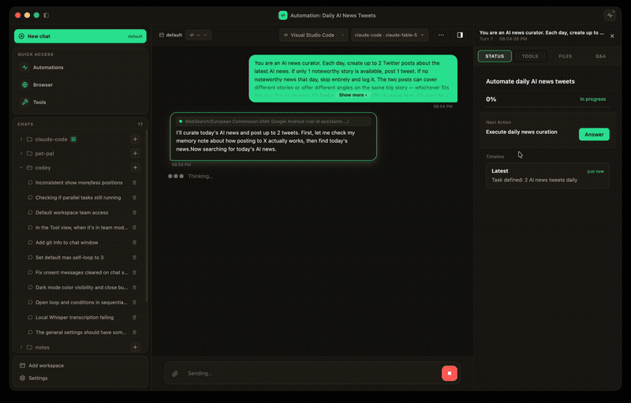

<p align="center">
  
</p>

# Codey 🚀 —— Claude Code / Codex / OpenCode / pi 的多 Agent 工作台

[English](README.md) | [中文](README.zh-CN.md)

<p align="center">
  <a href="https://github.com/its-ahoh/codey/releases/latest"></a>
  
  <a href="LICENSE"></a>
  <a href="https://github.com/its-ahoh/codey/stargazers"></a>
</p>

**面向编码 Agent 的多 Agent 工作台。** Codey 把 Claude Code、OpenCode、Codex 等编码 Agent 统一管起来：给每个项目独立的 workspace，按角色为 worker 配不同的 Agent / 模型，在同一个任务上并行跑多个 Agent 做对比；从原生 macOS 应用、聊天平台（Telegram / Discord / iMessage）或者全局语音输入都能用。

与其说它是"聊天平台到 Agent 的桥"，不如说它是**你已经在用的那些编码 Agent 的控制台**。它完全跑在你自己的机器上，直接复用你已装好、已登录的 Agent CLI —— 没有中间代理服务器，也不用额外订阅。

**目录：** [为什么用 Codey](#为什么用-codey) · [下载](#下载) · [功能特性](#功能特性) · [快速开始](#快速开始) · [配置](#配置) · [Team 与流程图](#工作者配置) · [命令](#命令) · [语音](#语音输入-macos) · [常见问题](#常见问题)

<p align="center">
  
</p>
<p align="center"><em>定时 Automation 自动搜集资讯、起草内容，并通过 Codey 内置的 Agent 控制浏览器完成发帖 —— 全程无人值守（2.5 倍速）。</em></p>

## 为什么用 Codey

- **一个项目里，不同任务用不同 Agent。** 每个 workspace 有默认 Agent / 模型，每个 worker 还能单独覆盖 —— Architect 用 Opus、Executor 用 Codex、Reviewer 用本地 OpenCode，都没问题。
- **同一个 prompt 让多个 Agent 并行跑。** 直接把 Claude Code / Codex / OpenCode 的结果摆在一起对比，不用靠猜。
- **用 worker 团队代替单条 prompt。** 给每个 worker 配角色、性格、工具，按顺序执行，或者让 dispatcher 自动挑选真正相关的子集。
- **多入口，随时调用。** 桌面用 macOS 菜单栏应用，在手机上用聊天平台派活，免手输直接用语音粘到任何前台应用。
- **完全本地，自己掌控。** 跑在你自己机器上，连你自己的账号，中间没有代理服务器。

## 下载

从 [Releases 页面](https://github.com/its-ahoh/codey/releases/latest) 获取最新的 macOS 应用：

- Apple Silicon：`Codey-<version>-arm64.dmg`
- Intel：`Codey-<version>.dmg`

当前发布版本未签名 — 首次启动时请右键点击应用 → **打开** → 确认以绕过 Gatekeeper。

## 功能特性

**Agent 管理**
- **多种编码代理**：Claude Code、OpenCode、Codex、[pi](https://pi.dev)（支持会话恢复）
- **并行执行**：同一个 prompt 让多个 Agent 同时跑，方便对比
- **每个 workspace 独立默认**：每个项目挑自己的默认 Agent + 模型
- **思考强度**：一个 low → max 的统一档位，自动映射到各家 CLI 自己的推理参数
- **自动 Dispatcher**：内置 dispatcher 可选，按任务自动路由到 team 的相关子集

**工作区与 Worker**
- **多工作区**：每个工作区拥有独立的工作目录、记忆与工作者
- **工作者团队**：每个 worker 可定义角色、个性、工具，以及自己的 Agent / 模型
- **流程图**：在画布上把一个 team 画成图，由裁判 LLM 按边上的自然语言条件决定下一步 —— 可以分支、回退返工，也可以停下来问你
- **记忆**：workspace 级 + 用户全局记忆，worker 每次运行都会读取，并把新结论写回去
- **对话上下文**：在会话中记忆之前的消息

**接入方式**
- **macOS 菜单栏应用**：多对话标签、工作区切换器、内嵌设置面板
- **聊天平台**：Telegram、Discord、iMessage
- **语音 (macOS)**：按住热键说话，直接粘进任何前台应用；也支持语音对话模式 —— 可选本地 WhisperKit（CoreML / Neural Engine）、OpenAI 兼容 API 或流式实时转写
- **健康检查端点**：内置健康检查和指标监控

**对话窗口内**
- **实时状态面板**：Agent 自己的 todo 列表和当前正在做的事，四家 CLI 统一呈现
- **文件改动**：整个对话里的所有修改，按文件分组，以 git 风格 diff 展示
- **Git 感知**：分支选择器、同步状态，以及可选的「每个对话一个 git worktree」隔离，多个对话并行也不会互相干扰
- **Quick Question**：只读的旁路提问线程，回答关于当前对话的问题但不影响它
- **`@` 引用文件、附件与主题**：输入 `@` 引用工作区文件；粘贴或拖入图片和文件；可切换配色主题

**技能、自动化与网页**
- **Skills 与 Playbooks**：技能可按 workspace 开关；Codey 会观察你的运行实际做了什么，把重复的流程沉淀成可复用的 playbook
- **Automations 定时自动化**：给 Agent 排日程 —— 每日发帖、定期检查、cron 式工作流，都在 Mac 应用里管理
- **Agent 控制的内置浏览器**：Agent 可以打开、阅读、点击、填表 —— 默认只读，所有会改变状态的操作都需要你确认
- **外部 MCP 服务器**：在 Mac 应用的 MCP 标签页里给 Agent 接入更多工具
- **QR 扫码配对**：扫码即可把 Telegram / iMessage 连到你的 gateway

## 快速开始

这是一个 monorepo，包含三个工作区：`@codey/core`、`@codey/gateway` 和 `codey-mac`。

```bash
# 安装依赖（所有工作区）
npm install

# 构建全部
npm run build

# 复制配置模板
cp gateway.json.example gateway.json

# 配置（可选）
npm run configure

# 启动网关
npm start
```

在开发模式下运行 macOS 应用：

```bash
npm run dev -w codey-mac        # 带热更新的开发模式
npm run build:mac -w codey-mac  # 在 codey-mac/release/ 生成 DMG
```

## 配置

编辑 `gateway.json`：

```json
{
  "gateway": {
    "port": 3000,
    "defaultAgent": "claude-code",
    "defaultModel": "claude-sonnet-4-20250514"
  },
  "channels": {
    "telegram": { "enabled": true, "botToken": "YOUR_TOKEN" },
    "discord": { "enabled": false, "botToken": "" },
    "imessage": { "enabled": false }
  },
  "agents": {
    "claude-code": { "enabled": true, "provider": "anthropic", "defaultModel": "claude-sonnet-4-20250514" },
    "opencode": { "enabled": true, "provider": "openai", "defaultModel": "gpt-4.1" },
    "pi": { "enabled": true, "provider": "anthropic", "defaultModel": "claude-sonnet-4-5" },
    "codex": { "enabled": true, "provider": "openai", "defaultModel": "gpt-5-codex" }
  },
  "profiles": [
    {
      "name": "default",
      "anthropic": { "apiKey": "sk-..." },
      "openai": { "apiKey": "sk-..." }
    }
  ],
  "activeProfile": "default",
  "dev": {
    "logLevel": "info"
  }
}
```

Auto-dispatch 设置：`dispatcher.{agent, model}`（可选）。

## 工作区结构

```
workspaces/
├── default/
│   ├── workspace.json       # 工作区配置（workingDir + 工作者）
│   ├── memory.md            # 项目记忆/笔记
│   └── workers/
│       ├── architect.md
│       └── executor.md
├── project-a/
│   ├── workspace.json
│   ├── memory.md
│   └── workers/
│       └── ...
└── project-b/
    ├── workspace.json
    ├── memory.md
    └── workers/
        └── ...
```

每个工作区通过 `workspace.json` 关联到一个项目目录：

```json
{
  "workingDir": "/path/to/project",
  "workers": {
    "architect": {
      "codingAgent": "claude-code",
      "model": "claude-opus-4-6",
      "tools": ["file-system", "git", "web-search"]
    }
  }
}
```

切换工作区（`/workspace myproject`）会自动设置代理的工作目录。

## 工作者配置

每个工作者在一个 Markdown 文件中定义：

```markdown
# Worker: Architect

## Role
负责项目规划的首席架构师...

## Soul
战略思维者，专注于可扩展性...

## Coding Agent
claude-code

## Model
claude-opus-4-20250514

## Tools
file-system, git, web-search

## Relationship
领导实现工作者

## Instructions
收到提示时，分析需求并提供...
```

## 命令

### 工作者
| 命令 | 描述 |
|------|------|
| `/workers` | 列出当前工作区的所有工作者 |
| `/worker <名称> <任务>` | 运行指定的工作者 |
| `/team <名称> [--all] <任务>` | 运行指定的 team（详见下方） |

**Team dispatch 说明：**

- `/team <name> [--all] <task>` — 运行指定的 team，成员按顺序串行执行，输出会作为下一个成员的输入。
  - 默认 `dispatch: 'all'`（所有成员参与）。
  - 配置为 `dispatch: 'auto'` 的 team 会先调用内置 dispatcher，自动选择本次任务真正需要的成员子集。临时跳过 dispatcher 可以加 `--all` 标志。
  - 在 worker 的 `config.json` 里加可选的 `dispatchHint` 字段（一句话）可以提升路由准确性。
  - Advisor 用的 agent/model 在 `gateway.json` 的 `advisor.{agent, model}` 字段配置，未配置时回退到 gateway 默认 agent/model。
  - 配置为 `dispatch: 'parallel'` 的 team 会以 **Advisor 主持的圆桌** 方式运行：所有 worker 作为长驻会话并发执行，
    在 `chats/<chatId>/discussion/` 下共享各自的意见文件；Advisor 循环评估进展、维护共享摘要，并决定何时问你、
    何时继续、何时结束。可选参数在 `parallel: { maxDurationMs, idleTimeoutMs, advisorPollMs }`。
    参见[设计文档](docs/superpowers/specs/2026-05-24-team-parallel-mode-design.md)。
  - 串行（`all`）team 还可以带一张**流程图** —— `graph: { entry, maxHops, nodes, edges }`。
    节点是 worker（外加 `start` / `end`），每条边上写一句自然语言条件。每个 worker 跑完后，
    由裁判 LLM（复用 Advisor 的 agent/model）按条件挑下一条边，因此流程可以分支，也可以回退到更早的 worker 返工，
    直到走到 `end` 或达到 `maxHops` 上限。worker 可以用 `[ASK_USER]` 暂停流程，你回复后会从暂停处继续。
    流程图可以在 Mac 应用的拖拽画布里直接画。

### 工作区
| 命令 | 描述 |
|------|------|
| `/workspaces` | 列出所有工作区 |
| `/workspace <名称>` | 切换到指定工作区 |

### 代理
| 命令 | 描述 |
|------|------|
| `/parallel <提示>` | 并行运行所有代理 |
| `/all <提示>` | 并行运行所有代理 |
| `/agent <名称>` | 切换默认代理 |

### 设置
| 命令 | 描述 |
|------|------|
| `/help` | 显示帮助信息 |
| `/status` | 显示网关状态 |
| `/clear` | 清除对话历史 |
| `/reset` | 开始新对话 |
| `/model <名称>` | 显示/设置模型 |

## 使用示例

```bash
# 切换工作区
/workspace myproject

# 列出工作者
/workers

# 运行工作者
/worker architect design a REST API

# 运行团队任务
/team build a todo app

# 并行运行所有代理
/parallel create a hello world app
```

## 语音输入 (macOS)

全局按键语音听写。按住配置的热键（默认 `Fn`）说话，松开后 Codey 转录并把结果直接粘贴到当前焦点输入框 — 不管你在哪个 app 都行。

**两种转录后端：**
- **本地 (WhisperKit)** — 在 CoreML / Neural Engine 上运行。模型首次使用时从 HuggingFace 拉取，默认为 `large-v3-turbo` 量化版（~954 MB）。完全离线、无需 API key。30 秒空闲后自动卸载模型，避免常驻 RAM / ANE
- **API** — 任何 OpenAI 兼容的 `/audio/transcriptions` 端点，配置 `apiUrl` / `apiKey` / `apiModel` 即可（如 `whisper-1`、`gpt-4o-transcribe`）

**HUD 浮窗：**
- **录音中**：浮动胶囊带 5 根实时音频条，能看到麦克风是否在拾音
- **转写中**：spinner + "Transcribing…"
- **已注入**：绿色 ✓，自动消失
- **没有可粘贴的焦点**：完整识别文本展示在更宽的卡片里，自动复制到剪贴板，点击关闭

**操作：**
- **热键**（默认 `Fn`）— 切换录音开关。可配置为 F 键或修饰键组合（如 `Cmd+Shift+V`）
- **录音中按 Esc** — 取消本次录音，buffer 直接丢弃，不转写

所有配置都在 macOS 应用的 **Whisper** 标签页：切换 provider、换模型、下载 / 预热 / 删除 WhisperKit 变体、改热键或注入方式（paste 或 Accessibility API）。

需要麦克风和辅助功能权限（首次启动会提示）。

## 健康检查端点

网关在 `port + 1` 端口暴露健康检查端点：

- `GET /health` - 完整状态 JSON
- `GET /metrics` - Prometheus 风格指标
- `GET /ready` - 就绪检查

## CLI 命令

```bash
npm run configure              # 交互式配置
npm run status                 # 显示配置
npm run set-agent claude-code  # 设置默认编码代理
npm run set-model              # 设置默认模型
npm run tui                    # 启动终端 UI
npm run build                  # 构建所有工作区
```

其他配置（渠道、Profile、API Key）请直接编辑 `gateway.json` 或在 macOS 应用的设置面板中调整。

## 项目结构

```
packages/
├── core/                # 共享类型、工作区与工作者管理器
│   └── src/
└── gateway/             # 网关服务、渠道、代理
    └── src/
        ├── agents/      # 编码代理适配器（claude-code、opencode、codex、pi）
        ├── channels/    # 聊天平台处理器（telegram、discord、imessage）
        ├── config.ts
        ├── conversation.ts
        ├── gateway.ts
        ├── health.ts
        ├── logger.ts
        └── index.ts
codey-mac/               # macOS 菜单栏应用（Electron + React）
├── electron/            # 主进程与 preload
└── src/                 # 渲染进程（React UI）
voice/                   # 原生 Swift helper（热键 + 录音 + WhisperKit）
└── Sources/CodeyVoice/  # AudioCapture、HotkeyManager、HudOverlay、WhisperKitEngine 等
workspaces/              # 各工作区的配置、记忆与工作者
```

## 常见问题

**Codey 是要替代 Claude Code / Codex / OpenCode 吗？**
不是，它是来驱动它们的。Codey 调用你本机已经装好、已经登录的 Agent CLI，在它们之上补一层：workspace、worker 团队、并行对比、定时任务和远程访问。

**必须要 API key 吗？**
用到才需要。如果你的 Agent CLI 已经登录（比如 Claude 订阅），Codey 直接沿用。`gateway.json` 里的 API key 只用于你想直连的 Agent / 模型，以及云端语音转写。

**我的代码会被上传吗？**
Codey 本身完全本地 —— gateway、macOS 应用、语音 helper 都跑在你自己机器上。代码只会去它本来就会去的地方（你选的那个 Agent CLI），不会多走一步。用本地 WhisperKit 时语音也不出本机。

**支持哪些平台？**
gateway 是 Node.js，Node 能跑的地方都能跑；桌面应用和语音输入目前仅限 macOS。

**能在手机上用吗？**
可以 —— 接上 Telegram、Discord 或 iMessage（扫码配对即可），在任何地方对同一批 workspace 发任务。

**这和开一堆终端窗口有什么区别？**
跨 Agent 共享的 workspace 与记忆、用 team 和流程图代替一次性 prompt、每个对话独立 git worktree 避免并行冲突、可定时的自动化，以及一个能同时看到所有运行状态、diff 和 todo 的界面。

## 许可证

[MIT](LICENSE)
